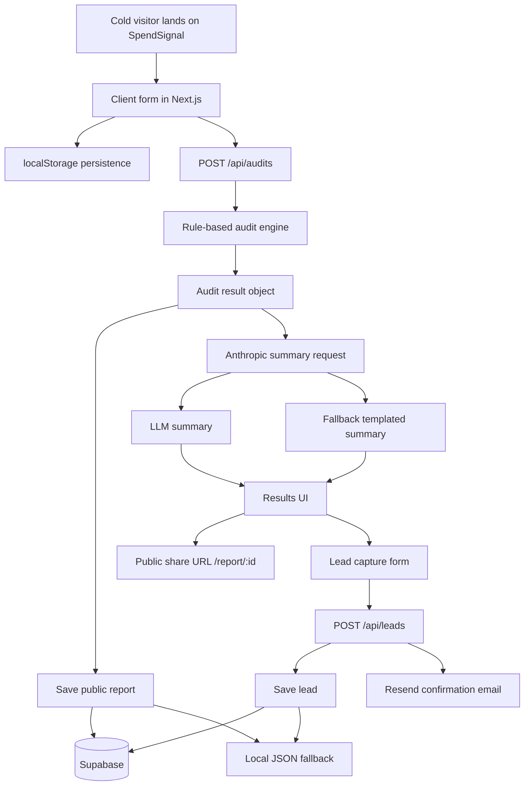

# Architecture

## System Diagram

## How User Input Becomes an Audit Result

1. A visitor enters team size, primary use case, and the tools they actively pay for.
2. The client persists form state in `localStorage` so the audit survives refreshes and tab closes.
3. On submit, the app sends the normalized payload to `POST /api/audits`.
4. The route handler calls `runAudit`, which applies deterministic pricing-fit rules:
   - solo or tiny-team downgrade checks
   - minimum-seat violations
   - overlapping tool consolidation
   - low-volume API-to-subscription recommendations
   - credits-opportunity notes for high recurring API spend
5. The server computes totals, outlook tier, and a fallback summary, then stores a public audit record with a unique ID.
6. The app attempts an Anthropic-generated summary. If that fails, the prebuilt fallback summary is returned instead.
7. The client renders a savings hero, per-tool breakdown, share link, and the post-value lead capture form.
8. If the user submits email details, `POST /api/leads` stores the lead and optionally sends a transactional confirmation email.

## Why I Chose This Stack

I used Next.js App Router with TypeScript because this product needs both a conversion-focused landing page and server behavior in the same codebase. The share loop depends on server-rendered public report URLs, Open Graph previews, route handlers, and an OG image endpoint, all of which fit naturally into App Router.

TypeScript matters here because pricing data and audit rules are the core product logic. Strong typing makes it harder to mismatch tool keys, plan keys, and result shapes while iterating on the audit engine.

For storage and email, I chose Supabase and Resend as the production path because they are quick to provision and easy to explain in an MVP. I also kept a local JSON fallback so the app still runs end to end without blocking on infrastructure setup.

The audit engine itself is intentionally non-AI. I only use AI for the personalized summary paragraph because recommendation math needs to stay deterministic, inspectable, and defensible to a finance-minded reviewer.

## What I’d Change at 10k Audits/Day

At 10k audits per day, I would keep the product shape but change the infrastructure and reliability model:

1. Move rate limiting out of process memory into Redis or an edge KV so limits hold across multiple instances.
2. Replace local JSON fallback entirely with a durable hosted datastore and explicit schema migrations.
3. Queue lead emails and summary generation asynchronously so the audit response is never blocked on third-party latency.
4. Add analytics and event instrumentation around form completion, result view, lead conversion, and share opens.
5. Cache or precompute expensive public report assets like OG images if traffic spikes on shared links.
6. Formalize audit rules into a versioned engine so recommendation changes can be tested and rolled out safely.
7. Add structured logging, tracing, and dashboard alerts around vendor failures, especially Anthropic, Supabase, and Resend.
